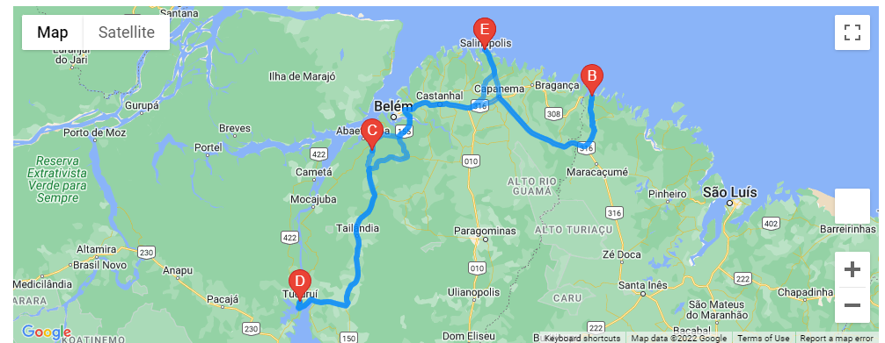
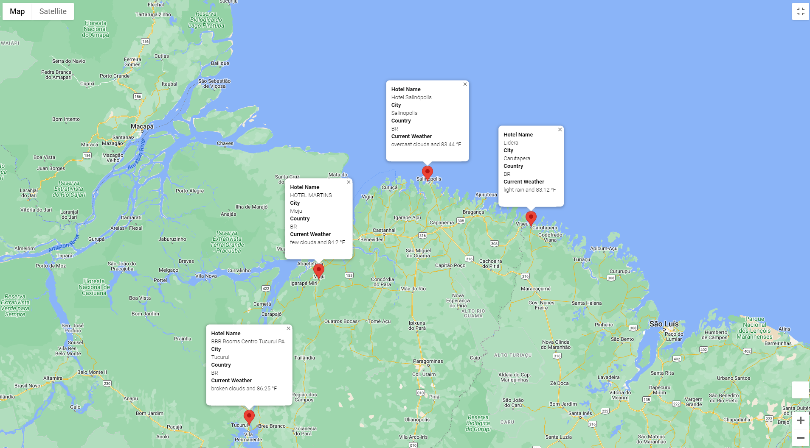

# World Weather Analysis

## Project Overview and Summary
In this project, the goal was to use Google Maps Directions and OpenWeatherMaps API to create a travel route between four cities using a marker layer map while providing hotel and weather conditions. 
- First by importing OpenWeatherMap's data we were able to pull the weather information for 2,000 different locations across the world. The weather infromation included latitude, longitude, max temperature, percent humidity, percent cloudiness, wind speed, and a brief weather description. 
- Second, by extracting data into a dataframe and exporting into a CSV file, a map of the entire country was created with markers using the Google Maps Directions API data.
Our travelers wanted a trip planned for Brazil. Selecting four cities that were relatively close within Brazil, the following traveling routes were arranged.

In addition, hotel names, city information, and current weather were also provided for each city provided as markers on the map.
